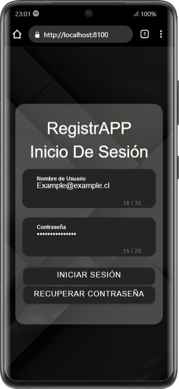
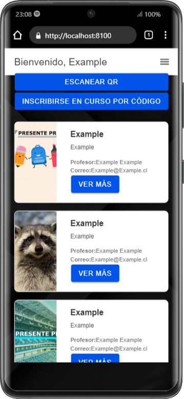
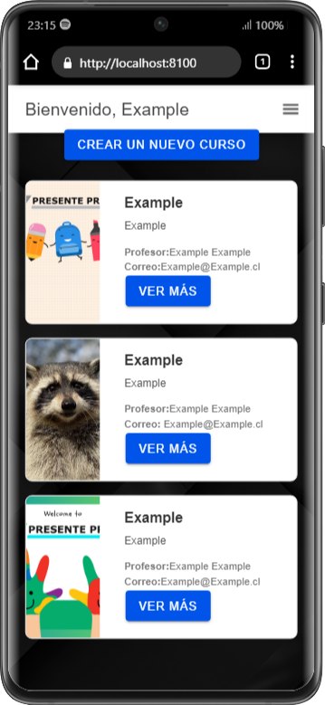
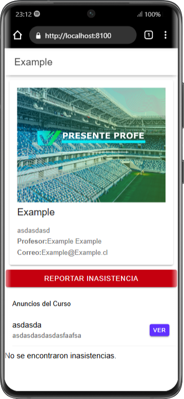
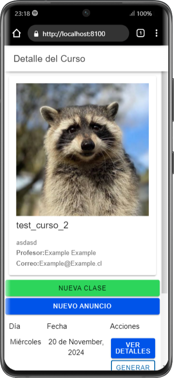
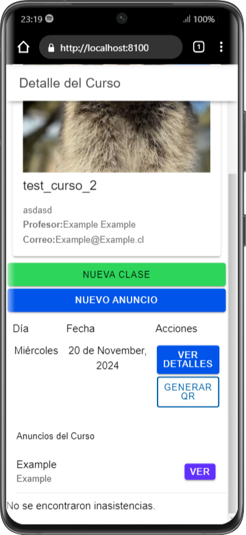
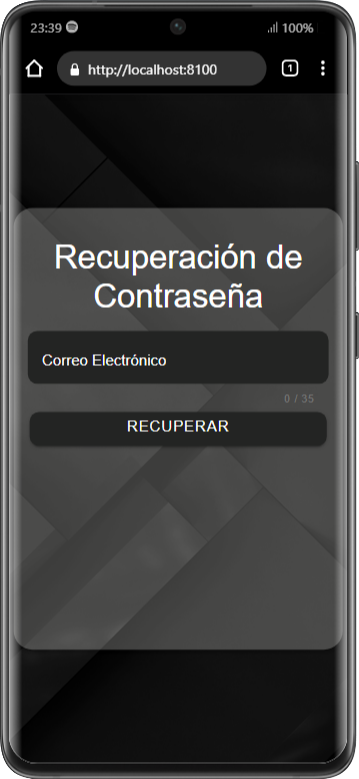
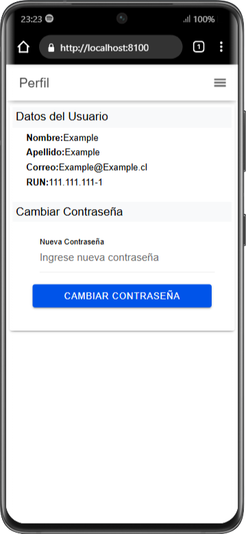

📱 RegistrApp
RegistrApp es una aplicación desarrollada con Ionic, Angular, TypeScript, Capacitor, Bootstrap, HTML, y CSS. Su objetivo es facilitar la gestión de cursos y clases, permitiendo a los estudiantes y docentes acceder a la información relevante de manera rápida y sencilla.

🛠️ Requisitos para ejecutar la aplicación
Instalaciones necesarias:
1. 🌐 Node.js
   Descarga e instala Node.js desde su página oficial: Node.js Official Website: https://nodejs.org/
   
2. 📦 Angular CLI
   Instala Angular CLI ejecutando el siguiente comando en la terminal:
   npm install -g @angular/cli
   
3. ⚡ Ionic CLI
   Instala Ionic CLI con el siguiente comando:
   npm install -g @ionic/cli
   
4. 🤖 Android Studio
   Descarga Android Studio desde su página oficial: https://developer.android.com/studio

🚀 Cómo ejecutar la aplicación
1. Clona el repositorio de la aplicación:
   git clone https://github.com/FrancesscoRipeti/Prueba-Programacion-Web.git
   cd Prueba-Programacion-Web

2. Instala las dependencias:
   npm install

3. Inicia la aplicación en el navegador:
   ionic serve

4. Si deseas compilar para Android, ejecuta:
   ionic capacitor build android
   Luego, abre el proyecto en Android Studio para compilar la APK.

📄 Descripción de las páginas (templates)
1. Home (Login)
   Es la página de inicio donde los usuarios (docentes o estudiantes) ingresan sus credenciales.
   Redirige según el perfil del usuario:
   - Estudiante: Página welcomealum.
   - Docente: Página welcome.
   Imagen:

2. Welcome (Estudiante)
   Aquí los estudiantes pueden:
   - Ver los cursos en los que están inscritos.
   - Acceder al detalle de cada curso y las clases asociadas.
   Imagen:

3. Welcome (Docente)
   Página similar a la de los estudiantes, pero con herramientas adicionales para gestionar cursos y clases.
   Imagen:

4. Detalle de Curso (Estudiante)
   Muestra información detallada del curso seleccionado:
   - Descripción.
   Imagen:

5. Detalle de Curso (Docente)
   Muestra información detallada del curso seleccionado:
   - Descripción.
   - Listado de clases.
   - Herramientas adicionales según el perfil.
   Imágenes:
   
   

6. Detalle de Clase (DOCENTE-ESTUDIANTE)
   Detalla los contenidos y actividades de una clase específica dentro de un curso.
   Imagen:

7. Recuperar Contraseña
   Página para recuperar la contraseña en caso de olvido, solicitando el correo registrado.
   Imagen:

8. Perfil (DOCENTE-ESTUDIANTE)
   Página donde los usuarios pueden:
   - Ver y editar su información personal.
   - Cambiar su contraseña.
   Imagen:

📚 Dependencias principales utilizadas
- Ionic Framework: Estructura y diseño de la aplicación.
- Angular: Framework para desarrollo frontend.
- TypeScript: Lenguaje principal de desarrollo.
- Capacitor: Para funciones nativas como compilación de la APK.
- Bootstrap: Estilos y componentes responsivos.
- HTML y CSS: Desarrollo de vistas y estilos personalizados.

💡 Características principales
- Acceso personalizado para docentes y estudiantes.
- Gestión y visualización de cursos y clases.
- Funcionalidades específicas según el perfil del usuario.
- Recuperación de contraseña integrada.
- Soporte para dispositivos Android.

🤝 Contribuciones
Si deseas contribuir al proyecto, envía un pull request o abre un issue en el repositorio:
RegistrApp en GitHub: https://github.com/FrancesscoRipeti/Prueba-Programacion-Web
